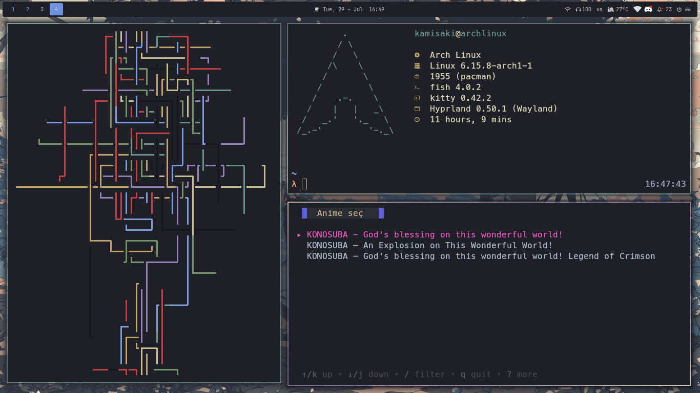
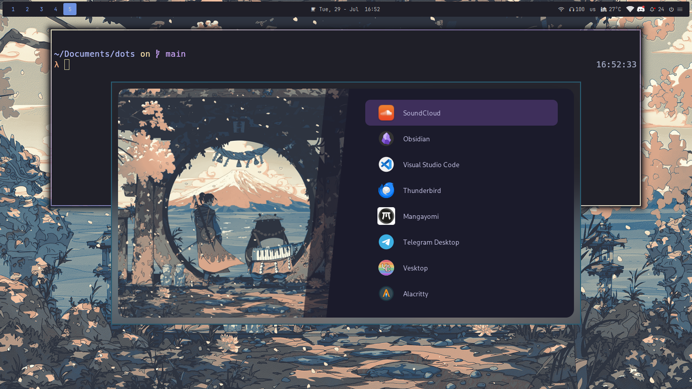

> [!WARNING]
> These dotfiles are **so messy**, **just looking at them** might give you **brain damage** or make you **go blind**.
> So please, **think a hundred times** before you try to use them.

> [!NOTE]
> Soon (I hope), I will upload some **less terrible** dotfiles, with a tool I (maybe) wrote myself, instead of HyDE.

# Dependencies

| Type           | Package(s)                                          |
| -------------- | --------------------------------------------------- |
| OS             | Arch Linux                                          |
| WM             | `hyprland`                                          |
| Bar            | `waybar`                                            |
| Terminal       | `kitty`                                             |
| Shell          | `fish`                                              |
| Prompt         | [pulsarship](https://github.com/xeyossr/pulsarship) |
| File Manager   | `dolphin`/`lf`                                      |
| Launcher       | `rofi`                                              |
| Notifications  | `dunst`/`swaync`                                    |
| OSD            | `swayosd`                                           |
| Editor         | `Visual Studio Code`                                |
| Discord Client | `vencord`                                           |

# Some shortcuts

| Shortcut                          | Action                   |
| --------------------------------- | ------------------------ |
| `Super + W`                       | Open browser `(firefox)` |
| `Super + T`                       | Open terminal `(kitty)`  |
| `Super + D`                       | Open discord `(vencord)` |
| `Super + A` / `Super + Space`     | Application finder       |
| `Super + Shift + E`               | File finder              |
| `Super + Tab`                     | Window switcher          |
| `Shift + F11` / `Alt + Return`    | Toggle fullscreen        |
| `Super + L`                       | Lock screen              |
| `Alt + Ctrl + Delete`             | Logout menu              |
| `Super + Shift + Q` / `Alt + F4`  | Close focused window     |
| `Super + Delete`                  | Kill Hyprland session    |
| `Super + /` / `Super + Shift + K` | Keybindings hint         |

## Screenshots

---

## Related Repositories

- [🪐 nixus-start-page](https://github.com/xeyossr/nixus-start-page) - My custom browser homepage
- [🥢 waybar_modules](https://github.com/xeyossr/waybar_modules) - My custom waybar modules
