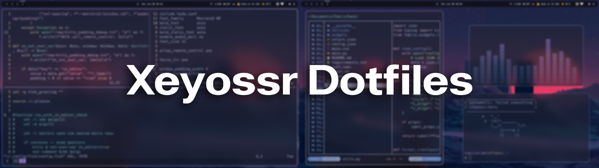
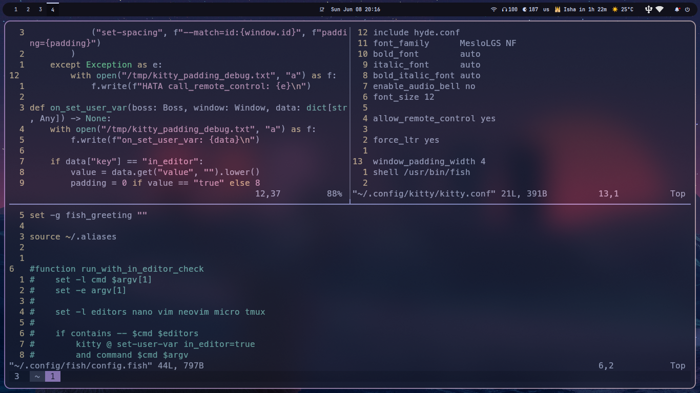
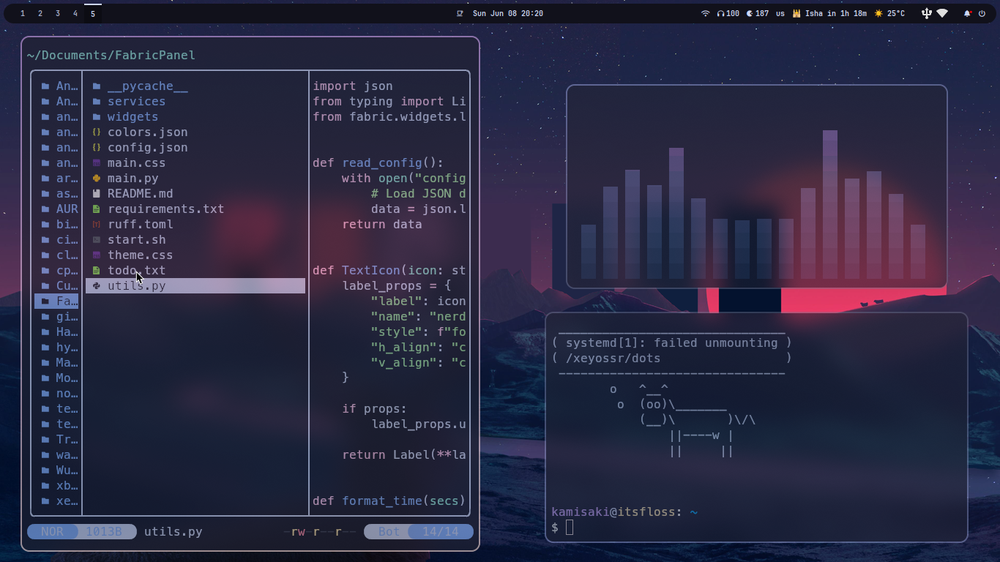

# Dependencies

| Type            | Package(s)                                           |
| --------------- | ---------------------------------------------------- |
| WM              | `hyprland`                                           |
| Bar             | `waybar`                                             |
| Launcher        | `rofi`                                               |
| Notifications   | `dunst`                                              |
| Terminal        | `kitty`                                              |
| Shell           | `fish`                                               |

You can also use `dots_pkgs/install.sh` to install all dependencies.

# Some shortcuts

| Shortcut               | Action                                      |
| ---------------------- | ------------------------------------------- |
| Super + Return (enter) | Launch floating terminal (`kitty`)          |
| Super + E              | Launch file manager (`dolphin`)             |
| Super + W              | Launch web browser (`brave`)                |
| Super + Shift + Q      | Close focused application                   |
| Super + Space          | Start program launcher (`rofi`)             |
| Super + 1-9            | Switch workspaces from 1 to 9               |

## Screenshots

